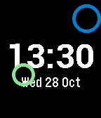
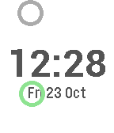
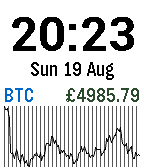

# Pebble to Rebble

I got a new phone a week or two after Pebble servers were finally switched off and then discovered that the apps and watchfaces I wrote a couple of years ago just disappeared when I paired my Pebble Time with the new phone. I couldn't find a way of getting them off the old phone and onto the new. Luckily, I'd published a couple of them ([Conway](https://apps.rebble.io/en_US/application/5627c5b4c361c93abe000072?query=conway&section=watchfaces) and [Bouncy](https://apps.rebble.io/en_US/application/562a1e207480836070000059?query=bouncy&section=watchfaces)) on the app store, and discovered [rebble](https://rebble.io/) had mirrored it and lots of other useful resources. I also managed to track down a couple of them (built binaries) on an old laptop I'd used at the time and installed them manually (by copying the .pbw file to the phone).

But mostly I just had the original source code, last built against a now-obsolete SDK. So I decided to see if I could get them working again in the post-pebble/rebble era, and eventually, with some help from the resurrected [rebble resources](https://developer.rebble.io/developer.pebble.com/index.html), and their [discord channel](https://discordapp.com/channels/221364737269694464/221397928592277504), I got a the old apps and watchfaces up and running, see [below](#sdk-installation).

I've open-sourced a selection of my apps/watchfaces from my private svn repo. Feel free to (re)use the code as you wish (it's a MIT licence). NB they've only been tested with the Pebble Time (aka basalt) hardware.

## Watchfaces

### Bouncy





Other than the time and date, this has 2 bouncing rings, the blue/grey one represents the bluetooth connection, the green/yellow/red one the battery charge. One of the rings is affected by gravity.

### Conway


Just the time, plus a 12x14 wrap-around implementation of [Conway's Game of Life]() (B36/S23 variant) in background. Starts with a randomly placed "glider". A new glider is added if you shake the watch, or if all cells die out. Cells are colour-coded according to their longevity. The time digits go pink if the bluetooth connection is lost.

### Ticker (BTCker)




Displays the GBP price of Bitcoin and a graph of the recent (~1.5days) history.

### Compass


Does what it says on the tin. Bearing is red during calibration (which can take a while, moving around helps)

### Gravball


Attempt at a bouncy ball game. Only the white ball is affected by gravity. Collisions with the red ball reduce its size.

### Pinger


Attempt at phone proximity detection by monitoring the bluetooth connection. Green if connected, red if not. Was intended for locating a lost phone but the (re)connection is too slow to be practical.

## SDK Installation

It's a bit confusing but there's two SDKs to install:

- First follow the installation instructions [from the original pebble site that rebble salvaged](https://developer.rebble.io/developer.pebble.com/sdk/index.html)

- Then do

```sh
pebble sdk install https://github.com/aveao/PebbleArchive/raw/master/SDKCores/sdk-core-4.3.tar.bz2
```

NB the `pebble` executable is not automatically on your `PATH`, even in the virtualenv. It's at `./pebble-sdk-4.5-linux64/bin/` if you'd rather not mess with your `.bashrc`.

## Clone and Build

First clone the repo

```sh
git clone https://github.com/virgesmith/rebble
```

Then choose one of the apps, e.g.

```sh
$ cd Conway
$ ./prebuild.sh
```

the prebuild script symlinks to the common directory, there are lots of source files shared across the apps. Would be nice to integrate this into `wscript` if possible.

Now build

```sh
pebble build
```

## Install

Turn on developer mode in the Pebble phone app, note the IP address, then

```sh
pebble install --phone <ip-addr>
```
