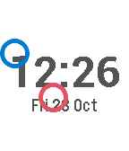

# Pebble to Rebble

I got a new phone a week or two after Pebble servers were finally switched off and then discovered that the apps and watchfaces I wrote a couple of years ago just disappeared when I paired with the new phone. I couldn't find a way of getting them off the old phone and onto the new. Luckily, I'd published a couple of them ([Conway](http://store.rebble.io/app/5627c5b4c361c93abe000072) and [Bouncy](http://store.rebble.io/app/562a1e207480836070000059)) on the app store, and discovered [rebble](https://rebble.io/) had mirrored it. I also managed to track down a couple of them (built binaries) on an old laptop I'd used at the time. 

But mostly I just had the original source code, last built against a now-obsolete SDK. So I decided to see if I could get them working, and eventually, with the help of the resources the rebble community have kept alive, and their [discord channel](https://discordapp.com/channels/221364737269694464/221397928592277504), I got a the old apps and watchfaces up and running.
 
I mostly use git and open-source my code on github these days, so I'll update some of my apps to work with the latest SDK and move them here... NB they are only tested with the Pebble Time (aka basalt) hardware.

# Watchfaces

## Bouncy




Other than the time and date, this has 2 bouncing rings, the blue/grey one represents the bluetooth connection, the green/yellow/red one the battery charge. One of the rings is affected by gravity.

## Conway


Just the time, plus a 12x14 wrap-around implementation of [Conway's Game of Life]() (B36/S23 variant) in background. Starts with a randomly placed "glider". A new glider is added if you shake the watch, or if all cells die out. Cells are colour-coded according to their longevity. The time digits go pink if the bluetooth connection is lost.

## Ticker (BTCker)


Displays the GBP price of Bitcoin and a graph of the recent (~1.5days) history.

## Compass


Does what it says on the tin. Bearing is red during calibration (which can take a while, moving around helps)

## Gravball


Attempt at a bouncy ball game. Only the white ball is affected by gravity. Collisions with the red ball reduce its size. 

## Pinger


Attempt at phone proximity detection by monitoring the bluetooth connection. Green if connected, red if not. Was intended for locating a lost phone but the (re)connection is too slow to be practical.

## SDK Installation

It's a bit confusing but there's two SDKs to install:

- First follow the installation instructions [from the original pebble site that rebble salvaged](https://developer.rebble.io/developer.pebble.com/sdk/index.html)  

- Then do

  ```
  $ pebble sdk install https://github.com/aveao/PebbleArchive/raw/master/SDKCores/sdk-core-4.3.tar.bz2
  ```

## Clone and Build
First clone the repo
```bash
$ git clone https://github.com/virgesmith/rebble
```

Then choose one of the apps, e.g.
```bash
$ cd Conway
$ ./prebuild.sh
```
the prebuild script symlinks to the common directory, there are lots of source files shared across the apps. Would be nice to integrate this into `wscript` if possible. 

Now build
```
$ pebble build
```

## Install
Turn on developer mode in the Pebble phone app, note the IP address, then
```bash
$ pebble install --phone <ip-addr>
```

